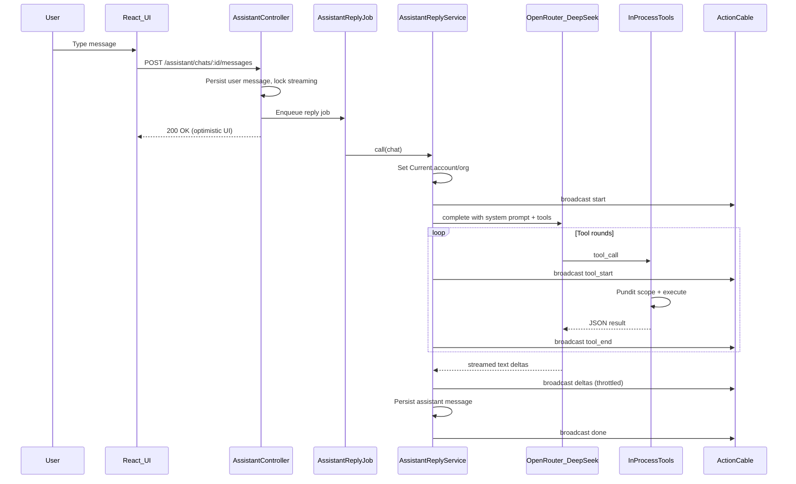
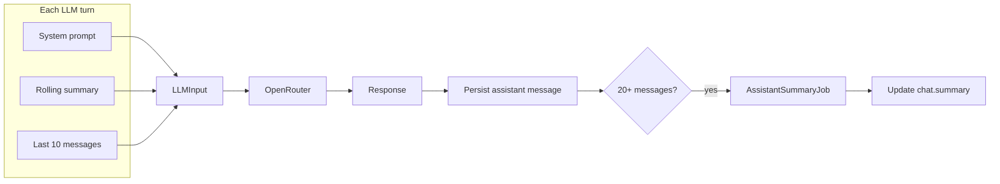
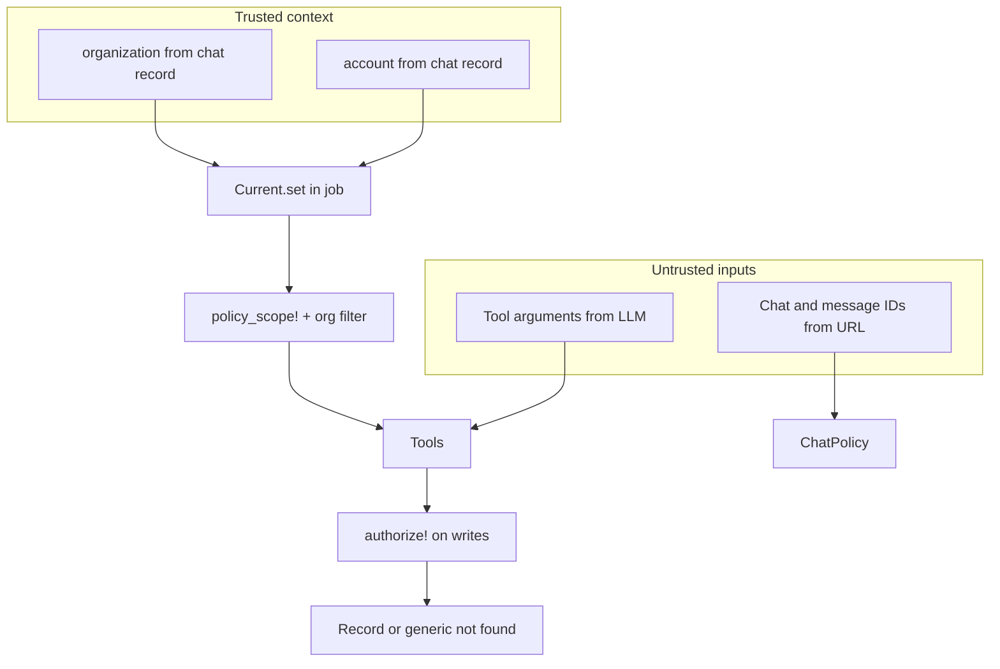

# Solution — Amplifa AI Assistant

## Overview

I built a ChatGPT-style assistant page in the customer sidebar. Users can create and resume chats, send natural-language requests, and watch replies stream in real time. The assistant can take real actions in the app — listing inbox conversations, updating interest status, searching leads, managing agent campaigns, and scheduling meetings — through 16 in-process RubyLLM tools.

The codebase already shipped an MCP server at `/mcp` with three example tools for external clients. I left that in place and built the in-app assistant on in-process tools instead, reusing the same Pundit policies and services the web UI already uses.

---

## Architecture at a glance

When a user sends a message, the controller saves it and enqueues a background job. The job calls OpenRouter (DeepSeek v4 Flash) with a system prompt, optional rolling summary, and the recent message tail. The model can call tools during the turn; results go back to the model until it produces a final text reply. Token deltas and tool activity stream to the browser over ActionCable.

Key files:

- [`app/controllers/assistant_controller.rb`](app/controllers/assistant_controller.rb) — chat CRUD and message creation
- [`app/jobs/assistant_reply_job.rb`](app/jobs/assistant_reply_job.rb) — async reply generation
- [`app/services/assistant_reply_service.rb`](app/services/assistant_reply_service.rb) — LLM orchestration, streaming, tool registration
- [`app/javascript/components/Assistant/useAssistantChat.ts`](app/javascript/components/Assistant/useAssistantChat.ts) — ActionCable subscription and resync on missed frames

---

## In-process tools vs MCP

There are two parallel tool systems, not one shared registry:

| | In-app assistant | MCP server |
|---|---|---|
| **Purpose** | Embedded chat in the Amplifa UI | External AI clients (Claude Desktop, etc.) |
| **Implementation** | 16 RubyLLM tool classes in [`app/tools/assistant/`](app/tools/assistant/) | 3 example tools in [`app/services/mcp/assistant_tools.rb`](app/services/mcp/assistant_tools.rb) |
| **Auth** | Rodauth session, chat ownership via `ChatPolicy` | OAuth 2.1 PKCE bearer token |
| **Scope** | Full feature set, rich schemas, mirrors UI controllers | Starter/reference pattern from the assignment |

**Why in-process for the deliverable:** The tools share Pundit policies with the web UI, call existing services (`ConversationInterestStatusUpdater`, `AgentLead#schedule_meeting!`, etc.), and run synchronously inside the LLM turn without JSON-RPC overhead. The MCP starter was useful as a scoping reference but was not the product surface I extended.

---

## Tool selection

Tool selection happens in two layers. There is no server-side intent router.

1. **Static registration** — all 16 tools are instantiated every turn in `AssistantReplyService::TOOL_CLASSES` ([`assistant_reply_service.rb`](app/services/assistant_reply_service.rb)).
2. **LLM-driven selection** — the system prompt in [`app/services/assistant_prompt.rb`](app/services/assistant_prompt.rb) routes intents (inbox → `conversation_list`, meetings → `meeting_list`, etc.) and enforces a tool-first rule: never answer workspace data from memory or guesswork.

**Tools by domain:**

- **Inbox (4):** list, stats, read thread, update interest status
- **Leads (1):** search by name, email, or company
- **Agents (5):** list, stats, lead list, pause/resume campaign
- **Meetings (5):** list, read, create, reschedule, cancel

Each tool mirrors an existing controller or service so behavior matches what the user would get from the UI.

---

## How LLM requests run

A few choices worth calling out:

- **Manual `RubyLLM::Chat` instead of `acts_as_chat.ask`** — the gem replays the entire persisted history, which defeats rolling summarization. I build a plain chat, seed it with the system prompt + `chat.summary` + only messages after the summary watermark, and persist the assistant reply myself.
- **Background job, not synchronous** — the controller returns immediately; the reply streams over ActionCable. A `streaming` flag on `Chat` prevents overlapping turns.
- **Fast model** — `deepseek/deepseek-v4-flash` via OpenRouter. Latency matters more than frontier reasoning for conversational Q&A.
- **Streaming throttled to ~80ms** — deltas are coalesced so a fast stream does not flood ActionCable.
- **Separate title job** — the first message triggers `AssistantTitleJob` to label the chat in the sidebar.
- **No job retry on reply failures** — the user is watching a spinner; failures broadcast immediately so they can retry. Summary and title jobs do retry.

**Context management:**

Every 20 messages, `AssistantSummaryJob` compresses older history into `chat.summary`, keeping the last 10 messages verbatim. This keeps context windows manageable without losing recent detail.

---

## Permission scoping

The assistant never gets broader access than the logged-in user. Tenant context comes from the chat record, not from anything the model sends.

**How it works in practice:**

1. **Context is injected at construction** — each tool receives `account:` and `organization:` in `initialize`. These are never read from tool arguments ([`app/tools/assistant/base_tool.rb`](app/tools/assistant/base_tool.rb)).
2. **Every read goes through `scoped(klass)`** — `Pundit.policy_scope!(account, klass).where(organization_id: organization.id)`.
3. **Every write calls `authorize!(record, :action?)`** — same predicates as the web UI (e.g. pause/resume campaign is admin-only).
4. **Foreign IDs return "not found"** — a cross-org ID never reveals that a record exists elsewhere.
5. **Background jobs set `Current`** — Pundit policies read `Current.organization_membership`. Without it, scopes fail closed.
6. **Chat ownership** — `ChatPolicy` restricts chats to the creating account within the active workspace. Amplifa admins are blocked because they have no customer workspace to scope tools against.
7. **Input hardening** — enum allow-lists, `sanitize_sql_like` for search terms, server-side limit caps, and strict ISO8601 parsing for meeting times.

**Tests:** 15 tool test files under [`test/tools/assistant/`](test/tools/assistant/), each with cross-org denial cases. [`test/services/assistant_prompt_test.rb`](test/services/assistant_prompt_test.rb) covers prompt invariants.

---

## Tradeoffs made

- **All tools registered every turn** — simpler than dynamic routing; costs extra tokens in the tool schema but avoids missing capabilities mid-conversation.
- **Prompt-based confirmation for writes** — no separate confirmation UI; destructive actions rely on system prompt instructions plus Pundit enforcement.
- **Tool activity not persisted** — `tool_start` / `tool_end` frames show chips during streaming, but only the final assistant text is stored.
- **Same cheap model for replies, titles, and summaries** — good enough for this scope; a smarter model could improve multi-step tool selection.
- **MCP not extended** — the three starter tools remain; full parity would duplicate maintenance.
- **No playbook tools** — the assignment mentions playbooks; I focused on inbox, leads, agents, and meetings first.
- **Sequential tool execution** — ruby_llm 1.11 has no concurrency option; multi-tool turns are slower but safer.
- **Centralized error handling in `BaseTool`** — required because uncaught exceptions in ruby_llm 1.11 kill the entire stream.

---

## What I would do differently with more time

### Assistant-specific improvements

The biggest functional gap is playbooks — adding read and update tools would complete the "anything the user can do in the UI" goal. I would also unify MCP and in-process tools behind a single implementation layer so both entry points share one test suite.

For destructive actions (pause campaign, cancel meeting, delete chat), I would add explicit user confirmation in the UI rather than relying on prompt instructions alone, plus a timed undo window to reverse mistakes. On the LLM side, dynamic tool routing would register only relevant tools per intent to cut schema token cost, and persisting `ToolCall` records would give an audit trail and a "what did the assistant do?" view. Complex multi-step queries could route to a stronger reasoning model while keeping fast lookups on Flash. Rate limiting and per-org token budgets would matter at scale, and end-to-end browser tests would complement the unit tests for the full streaming flow.

### Technical improvements and feature roadmap

Beyond the assistant itself, I would audit the tool layer against OWASP best practices, add chat archiving (paired with undo for a safer lifecycle), and Dockerize the app for reproducible deployments. The frontend would benefit from full accessibility — keyboard navigation, screen reader support, proper ARIA labels — and React Query for server-state caching of chat lists and message pagination. Thorough responsive and cross-browser testing (Chrome, Firefox, Safari, Edge) would harden the UI across devices.

On the platform side, a deeper pass on the database schema would inform future tool design and query performance. Observability with Prometheus and Grafana (or equivalent) would track request success rates, job latency, and LLM error rates. I would stress-test edge cases, intentionally break workflows, and replace unclear errors with user-friendly, actionable feedback.

### Workflow and codebase reflection

Some comments in the codebase are AI-generated scaffolding that should be cleaned up in a refactoring pass. Delivery involved ramping up on Ruby and ruby_llm while leveraging AI agents under time constraints. With more time, a structured process — clear requirements, defined tickets, sprint planning — would improve velocity and make tradeoffs visible earlier.

---

## Assumptions

- The assistant is for customer users and customer admins only. Amplifa admins are excluded.
- An OpenRouter API key is required for live LLM calls. Tests stub outbound HTTP.
- Saved prompts and chat sidebar pagination are UX enhancements beyond the minimum requirements.
